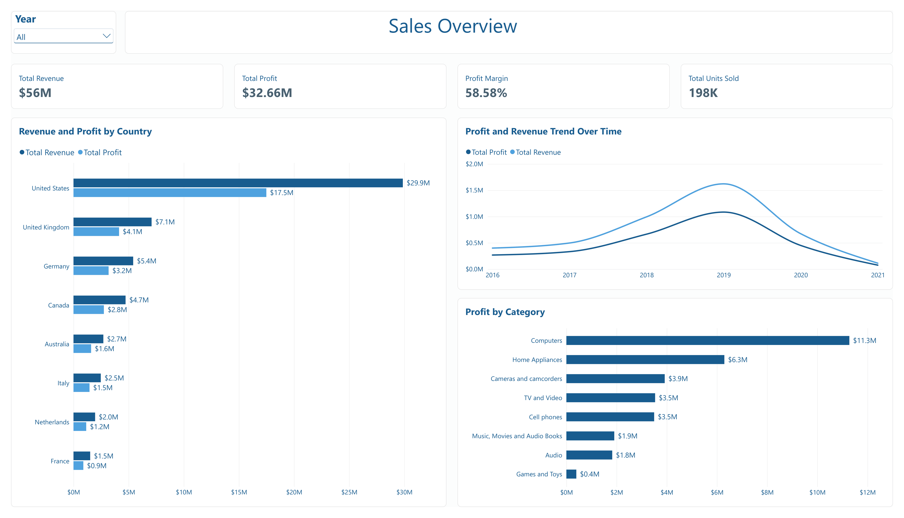
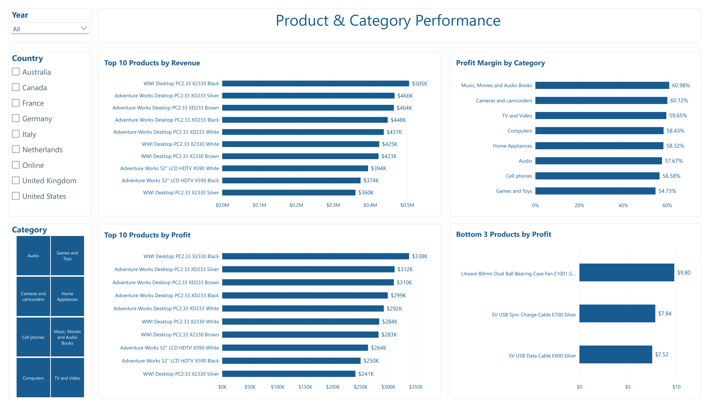
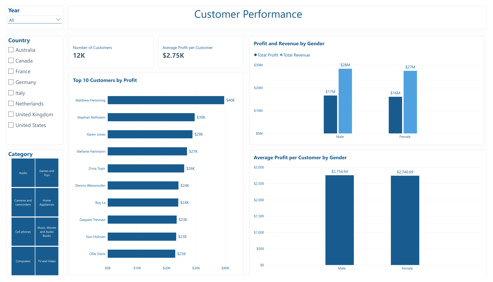
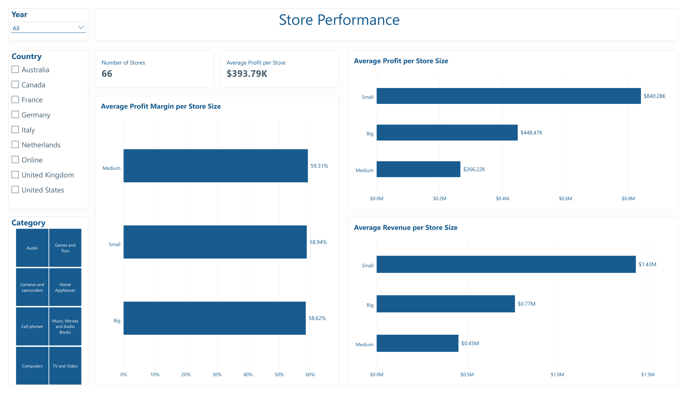

# Sales Analysis

# Sales Analysis

Sales analysis using SQL and Power BI to identify trends, top-performing products, and revenue drivers.

## Project Overview

This project analyses the sales performance of a technology and electronics retailer operating across 8 countries, with 66 physical stores and an online sales channel.

The analysis combines SQL and Power BI to evaluate business performance and identify the products, categories, markets, customers, and stores that have the biggest impact on revenue and profitability.

## Business Questions

### Overall Performance

* What are the overall sales, revenue, cost, profit, and profit margin?
* How does business performance change over time?

### Product Performance

* Which products generate the most revenue?
* Which products generate the most profit?
* Which products have the lowest profit?
* How does product performance change across countries, categories, and sales channels?

### Market Performance

* Which countries generate the most revenue and profit?
* Which product categories perform best in each country?
* Which products perform best in each country?

### Customer Performance

* Who are the most valuable customers?
* How does customer profitability differ between genders?
* How does the ranking of high-value customers vary across countries?

### Store Performance

* How does store size relate to revenue and profitability?
* Does store size have a significant impact on profit margin?

## Key Insights

* The business generated **$55.76M in revenue** and **$32.66M in profit**, resulting in an overall **58.58% profit margin**.
  
* Revenue and profit followed a **strong upward trend until 2019**, before declining.

* The **United States** is by far the largest market, generating approximately **$29.87M in revenue** and **$17.49M in profit**. However, profit margins are relatively consistent across all countries.

* **Computers** is the strongest category by total profit, generating approximately **$11.3M**, compared with approximately **$6.3M** for the second-highest category.

* **Music, Movies and Audio Books** has the highest profit margin at **60.98%**, while **Games & Toys** has the lowest at **54.73%**.

* The **Top 10 products by revenue are exactly the same as the Top 10 products by profit, in the same order**, indicating a strong relationship between revenue and profit at product level.
  
* Product rankings change depending on **country, category, and sales channel**, showing that global rankings can hide market-specific patterns.
  
* The three lowest-profit products still generate positive profit, but each contributes less than **$10** in total profit.
  
* Average profit per customer is almost identical between genders: **$2,754.64 for male customers** and **$2,740.69 for female customers**, a difference of only approximately **0.5%**.
  
* Five of the global **Top 10 customers by profit** are based in the United States, indicating some geographic concentration among the highest-value customers.
  
* **Small stores** show the highest average revenue and profit per store, at approximately **$1.43M revenue** and **$840K profit per store**. However, there are only **8 Small stores**, compared with **53 Big stores**, so this result should be interpreted cautiously.
  
* Profit margins remain very similar across store sizes: **58.94% for Small, 59.31% for Medium, and 58.62% for Big stores**, suggesting that store size has limited impact on profit margin.

## Tools

* **SQL (PostgreSQL)** — Data preparation, aggregation and analysis
* **Power BI** — Data visualisation and dashboard development

## SQL Analysis

The SQL analysis consists of 9 queries covering overall sales, product, market, category and store performance.

The queries used for the analysis are available in the [`SQL/core`](./SQL/core/) folder.

The SQL analysis was used to identify key business patterns and validate the calculations and findings presented in the Power BI dashboard.

## Power BI Dashboard

The Power BI dashboard consists of 4 interactive report pages, each focused on a different aspect of business performance.

### 01 — Sales Overview

Provides a view of overall business performance through:

* **Total Revenue**
* **Total Profit**
* **Profit Margin**
* **Units Sold**
* **Revenue & Profit by Country**
* **Profit & Revenue Trend Over Time**
* **Profit by Category**

A Year slicer allows users to explore performance across different periods, with the trend chart supporting drill-down from yearly to monthly performance.

### 02 — Product & Category Performance

Focuses on product and category performance through:

* **Top 10 Products by Revenue**
* **Top 10 Products by Profit**
* **Profit Margin by Category**
* **Bottom 3 Products by Profit**

The page can be filtered by **Year, Country, and Category** to investigate product performance within different business contexts.

### 03 — Customer Performance

Focuses on customer value and profitability through:

* **Number of Customers**
* **Average Profit per Customer**
* **Top 10 Customers by Profit**
* **Profit & Revenue by Gender**
* **Average Profit by Gender**

The customer count is based on customers with recorded sales.

### 04 — Store Performance

Examines the relationship between store size and commercial performance through:

* **Number of Stores**
* **Average Profit per Store**
* **Average Revenue per Store**
* **Average Profit Margin per Store**

For analytical purposes, stores were grouped according to their physical size:

* **Small:** < 500 m²
* **Medium:** 500–999 m²
* **Big:** ≥ 1,000 m²

These categories were created specifically for this analysis and do not represent an official retail industry classification.

## Business Recommendations

* **Investigate the post-2019 decline** by analysing product, country, category, and sales channel performance to identify the areas contributing most to the decrease in revenue and profit.

* **Preserve the Computers category** as a key profit driver while monitoring its performance and contribution to overall profitability.

* **Evaluate product performance within its business context** by considering country, category, and sales channel rather than relying solely on global product rankings.

* **Investigate the strong performance of Small stores** before making decisions about store expansion or physical footprint, particularly given the small number of Small stores in the dataset.

## Limitations

* The available 2021 data only covers January and February and cannot be compared directly with complete years.
  
* Store-size groups are highly unbalanced, with **8 Small, 5 Medium, and 53 Big stores**.
  
* The customer analysis focuses on customers with recorded sales rather than the entire customer master table.

## Conclusion

This project demonstrates a business analysis workflow using **PostgreSQL and Power BI**, from data preparation and SQL analysis to interactive dashboard development and business recommendations.

The analysis highlights the main drivers of revenue and profitability while demonstrating how business performance can vary depending on **country, product, category, customer, sales channel, and store size**.

The combination of SQL analysis and Power BI provides both detailed analytical insights and an interactive way to explore the results from different business perspectives.

